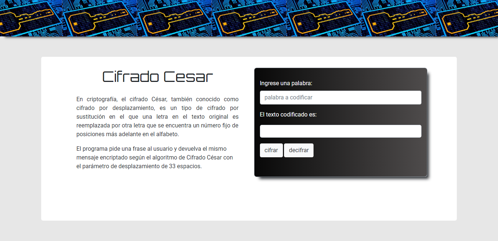
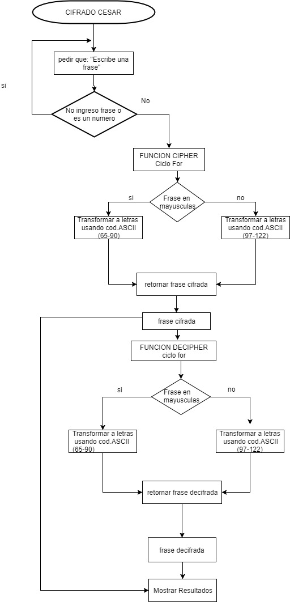

# Cifrado César

## Objetivo  
Crear una web que pida, por medio de un `imput`, una frase al usuario y
devuelva el mismo mensaje encriptado según el
[algoritmo de Cifrado César](https://en.wikipedia.org/wiki/Caesar_cipher)
con el parámetro de desplazamiento de **33 espacios hacia la derecha**

    
## Contenido
1. Diagrama de flujo

2. Archivo `app.js` para la funcionalidad.
3. Archivo `index.html`.
4. Archivo `main.css` para los estilos de la pagina.

## Desarrolladora
Elizabeth Segura F.

